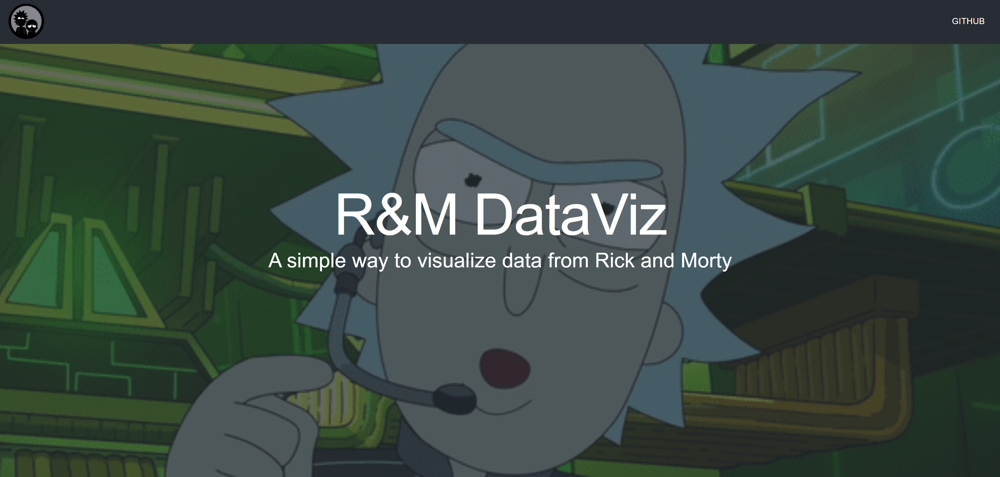
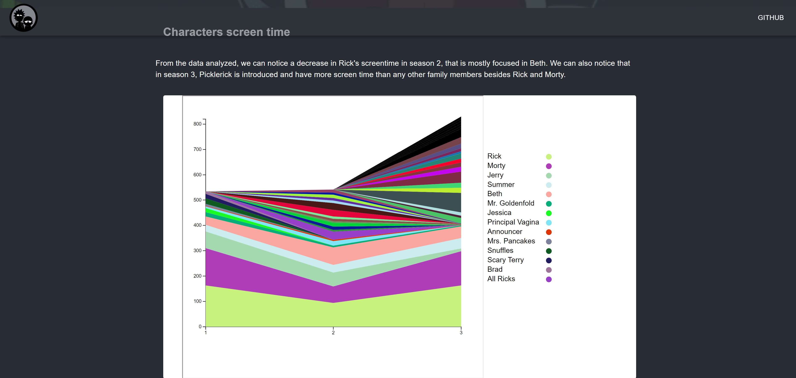
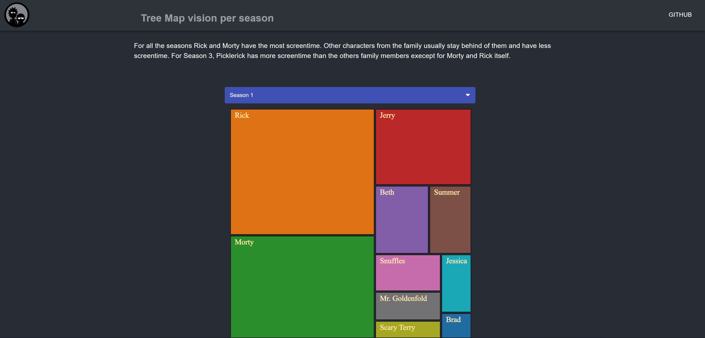
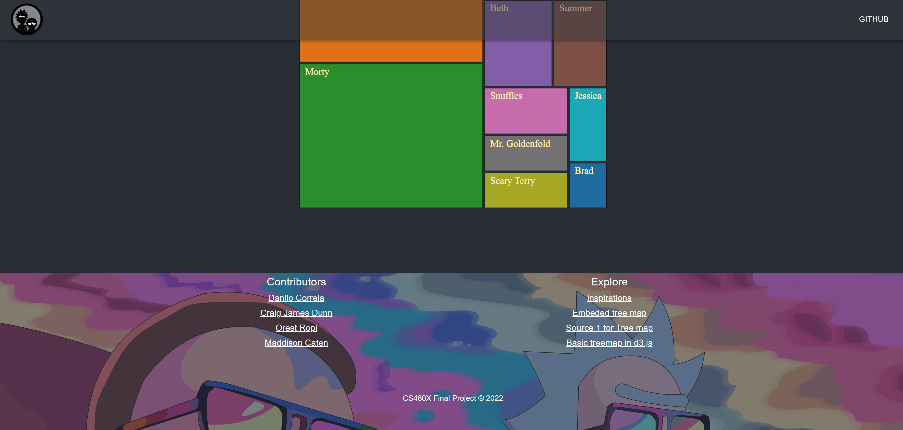

### Overview of Project:

Rick and Morty Data Viz for representing characters screen time. Using a stacked area chart and treemaps, in a rick and morty themed react based website.

### Overview of Handling:

All of the code is our own except a simple skeleton for a treemap(in d3.js) and dropdown bar(in js). We also used the d3 library and a simple library for icons we use throughout our websites from fontawesome.com.

### Technologies used:
The website is made with React and Material UI. Besides D3, there was also a Chart JS code in the early versions of the app. The code architecture follows the classic structure with components for each section of the website. Our main website runs on node.js. For our secondary websites we used glitch to host them, running them on http server.

The introduction section contains the title and a background gif.

Staked area chart

Tree map chart

Footer

### Project Website(s):

Link to main website:https://dacs30.github.io/final/

Link to website with just treemaps: https://rickandmortyfp.glitch.me/

Link to video:https://drive.google.com/file/d/1SRcv2gGc4mXVZa7gMXJ80TmX6y1y9Kez/view?usp=sharing

References:
---

Link:https://towardsdatascience.com/the-office-story-thats-what-the-data-said-224e8a6f47e

Link:https://www.youtube.com/watch?v=f_E5d9Gt5nM&ab_channel=BeforeSemicolon

Link:https://www.d3-graph-gallery.com/graph/treemap_basic.html

- This final project is adapted from https://www.dataviscourse.net/2020/project/

Resources
---
Data: https://www.kaggle.com/andradaolteanu/rickmorty-scripts
